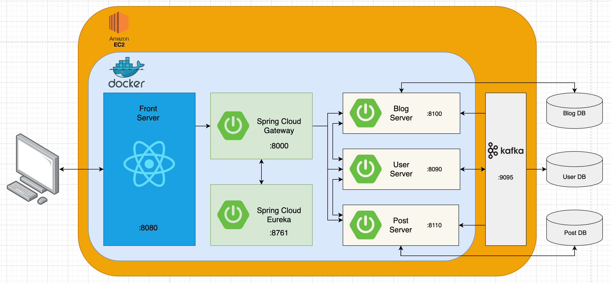

## **프로젝트 개요**

> ***“많은 사용자와 트래픽에 대처 가능한 유연한 아키텍처”***
> 

인터넷 사용자의 급증과 개발인구의 증가는 개발 관련 커뮤니티의 수요를 늘리고 있다. 한국형 StackOverflow를 지향하고 있는 HelloWorldWeb은 늘어나는 수요와 트래픽에 발맞추어 진화해야 한다. 단일 서버가 유저의 모든 요청을 처리하는 Monolithic 아키텍처는 한 모듈에서 발생한 에러가 전체 시스템에 영향을 미칠 수 있고, 서버 규모가 커짐에 따라 확장과 유지보수가 어렵다. 따라서 기존의 Monolithic 서버 구조를 여러 부분으로 나누어 MSA(Micro Service Architecture) 형태의 서버로 형태를 전환하고, 기존 프로젝트에서 아쉬웠던 부분들을 보완하여 더 나은 형태의 서버를 구축한다.

### 목적

늘어가는 커뮤니티 트래픽에 대응하기 위해 서비스 전반적인 구조를 변경한다. 또한 서비스 로직의 효율적인 수행을 위해 데이터베이스 접근 쿼리의 최적화를 진행한다. 분산된 서버 구조에서 정상적인 서비스 수행을 위한 서버 간 데이터 정합성 및 일관성 유지 로직을 구현한다.

### 기대 효과

**1) 서버의 모듈화**

특정한 서비스 단위로 서버와 데이터베이스를 분리하여 모듈화한다. 각 서버는 높은 응집도를 가지며, 모듈 단위로 개발 가능하여 협업에 유리하다.

**2) 장애 허용과 장애 복구**

형태적으로 분리된 서버 구조로 인하여 특정 서비스에서의 에러가 다른 서비스로 전파될 가능성이 낮아진다. 또한 메시지 큐 기반의 서버 간 통신 로직으로 인하여 장애의 복구 이후 처리 또한 가능하게 구현할 수 있다.

**3) 유연한 확장**

추가적인 서비스가 필요한 경우 해당 서비스를 수행하는 서버 개발 이후 이식을 통해 서비스를 쉽게 확장할 수 있다. 또한 개별 서버는 해당 서버에서 다루는 주요 로직에 최적화 된 프레임워크 혹은 데이터베이스를 선택하여 사용할 수 있다.

---

### ERD

**UserServer**

**PostServer**

**BlogServer**

---

### 서비스 아키텍처(예정)

---

### 사용 기술 스택

- SpringBoot, Gradle
- Spring Data JPA, H2, MySQL
- AWS EC2, S3, RDS
- JUnit5, Kafka
- React

---

### 담당한 역할

- Blog Server DB설계 및 연관관계 정의
- Blog Server 서비스 로직 개발
- Mockito, Junit, MockMVC를 이용한 단위 및 통합 테스트 작성
- Kafka를 통한 분산 서버 통신 로직 구현
- 서버 간 데이터베이스 일관성 및 정합성 유지 로직 구현

---

### 주요 개발 내용

[쿼리 최적화](https://www.notion.so/93a564f24ee041839acff7215ea6fbd1)

[FetchJoin과 Default_batch_fetch_size](https://www.notion.so/FetchJoin-Default_batch_fetch_size-c0f3285f43d54720aee643dbbf8a5271)

[JWT인가 방식 변경](https://www.notion.so/JWT-0799fc053ee54ec682bca510a73b0b95)

[Kafka 적용(HelloWorldWeb - MSA)](https://www.notion.so/Kafka-HelloWorldWeb-MSA-402bd468c6ab4116bbf868cdd2c9de7f)

[Consumer → Producer UserDB 동기화](https://www.notion.so/Consumer-Producer-UserDB-5e8367c64fb24c308bc122ca173bd3c6)

---

### 발생했던 문제와 해결

[필터에서의 유저조회와 프록시](https://www.notion.so/b3ae1988273643ee822a7a53f3e225cf)

[JWT를 통한 유저조회, 꼭 필요할까? ](https://www.notion.so/JWT-63226a245aec4a2b8402f9422b64c818)

[Kafka Transaction Manager ](https://www.notion.so/Kafka-Transaction-Manager-a50de66e3f57467382e27b72e2d04bf5)

[Consumer → Producer UserDB 동기화](https://www.notion.so/Consumer-Producer-UserDB-57088e8fa9cb4443a1d4563fc7f09ec9)

[서버 오류 복구와 Kafka Partition](https://www.notion.so/Kafka-Partition-75421efc310b4411a9f48e27d49e857e)

---

### 배운 점

- SRP(단일 책임 원칙) 준수 및 로직의 철저한 계층화
- 테스트 코드 작성의 이점과 편리함
- FetchJoin, Default_batch_fetch_size 등 조회 쿼리를 줄이기 위한 여러 쿼리 최적화 방법
- 발생할 수 있는 대부분의 예외를 Controller에서 처리 가능
- Kafka를 통한 분산 서버 간 통신 구현
- 분산 서버에서의 데이터베이스 정합성 유지 방법
- MSA 아키텍처의 실제 적용과 장단점 경험

---

### 아쉬운 점

- 외부 서버와 통신하는 컨트롤러 로직의 테스트 코드 작성 실패
- Kafka Serializer/Deserializer JSONSerializer 사용 실패
- 다양한 데이터베이스나 프레임워크를 사용하지 않아 MSA의 완전한 이점을 누리지 못함
